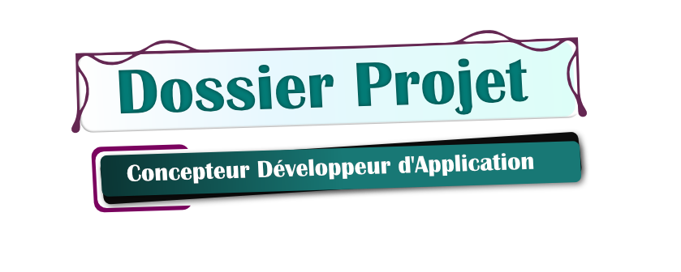
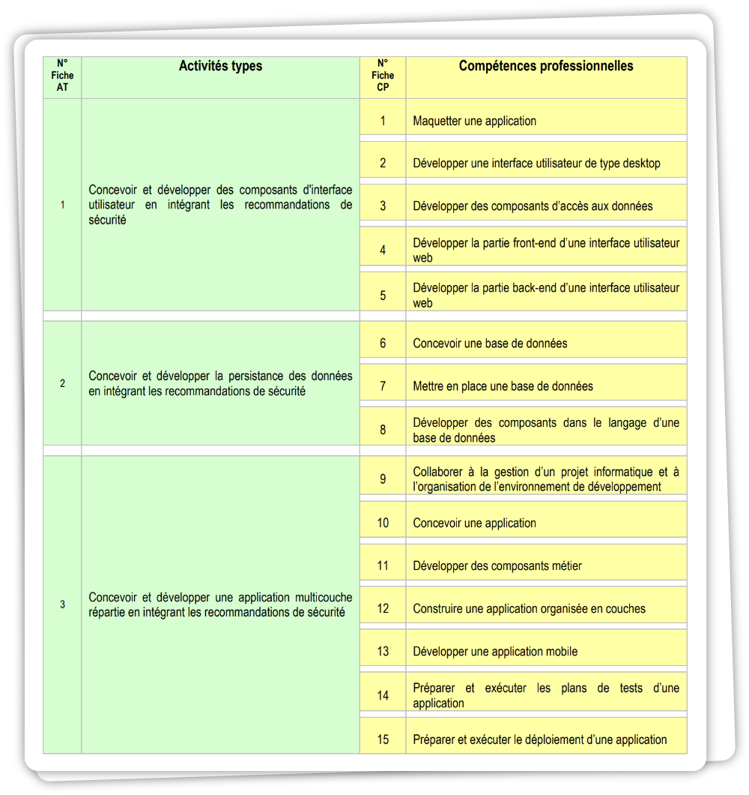

# Sommaire

- [Introduction](#introduction)
- [Tableau des compétences](#tableau-des-compétences)

# Navigation 

- [Mon Parcours](./doc/presentation.md)
- [Structure du projet](./doc/structure_projet.md)
- [Documents éphémères](./doc/tools_dev.md)
 

# Introduction

Ce dossier de projet a pour objectif de mettre en avant la maîtrise des compétences attendues pour l'obtention du titre de Concepteur et Développeur d'Applications.

Pour cela, j'ai structuré mon projet en trois grandes parties, basées sur les AT (Activités Types) et les CP (Compétences Professionnelles), afin de couvrir l'ensemble des compétences exigées.

Ce projet s'inscrit dans un travail collaboratif réalisé avec la promotion 4 CDA de l'école SIMPLON Hauts-de-France, où nous avons conçu et développé ensemble des bots à travers une organisation structurée en groupes, chacun étant dédié à la mise en place d'un bot spécifique. Cette expérience m'a permis d'appliquer mes connaissances tout en suivant des méthodologies modernes adaptées aux exigences actuelles.

<!-- # Liste des compétences

- [AT 1 : Développement d'interfaces sécurisées](./doc/at1.md)

(Concevoir et développer des composants d'interface utilisateur en intégrant les recommandations de sécurité)

- [AT 2 : Gestion sécurisée des données](./doc/at2.md)

(Concevoir et développer la persistance des données en intégrant les recommandations de sécurité)

- [AT 3 : Développement d'applications multicouches](./doc/at3.md)

(Concevoir et développer une application multicouche répartie en intégrant les recommandations de sécurité) -->

---

<!-- - Liste des compétences du référentiel qui sont couvertes par le projet
- [Résumé du projet](./doc/resume_projet.md)
- Cahier des charges
- Gestion de projet
- Spécifications fonctionnelles
- Spécifications techniques
- Réalisations
- Demonstration 
- Et si c'était à refaire? --> 

# Tableau des Compétences

<!--  -->

