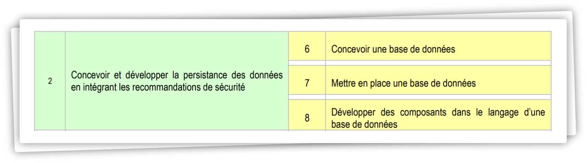

 

# **AT 2** : *Gestion sécurisée des données*

# Sommaire

<!-- - [Introduction](#introduction)  
- [Objectif](#objectif)   -->
- [Concevoir une base de données](#concevoir-une-base-de-données)  
- [Mettre en place une base de données](#mettre-en-place-une-base-de-données)  
- [Développer des composants dans le langage d'une base de données](#développer-des-composants-dans-le-langage-dune-base-de-données)  

# Introduction

# Objectif

(Concevoir et développer la persistance des données en intégrant les recommandations de sécurité)

## Concevoir une base de données 
## Mettre en place une base de données
## Développer des composants dans le langage d'une base de données 

