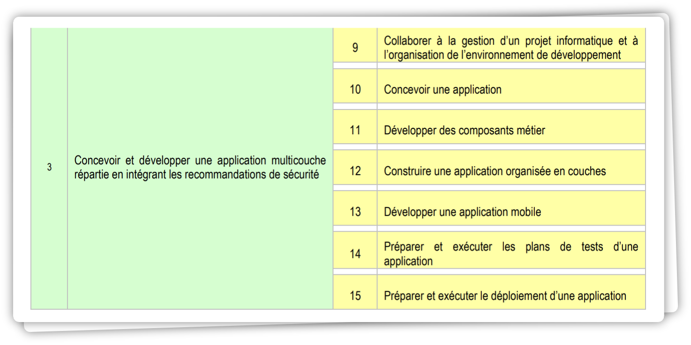

 

# **AT 3** : *Développement d'applications multicouches*

# Sommaire

<!-- - [Introduction](#introduction) -->
- [Collaborer à la gestion d'un projet informatique et à l'organisation de l'environnement de développement](#collaborer-à-la-gestion-dun-projet-informatique-et-à-lorganisation-de-lenvironnement-de-développement)  
- [Concevoir une application](#concevoir-une-application)  
- [Développer des composants métier](#développer-des-composants-métier)  
- [Construire une application organisée en couches](#construire-une-application-organisée-en-couches)  
- [Développer une application mobile](#développer-une-application-mobile) 
- [Préparer et exécuter les plans de tests d'une application](#préparer-et-exécuter-les-plans-de-tests-dune-application) 
- [Préparer et exécuter le déploiement d'une application](#préparer-et-exécuter-le-déploiement-dune-application) 

# Objectif

(Concevoir et développer une application multicouche répartie en intégrant les recommandations de sécurité)

## Collaborer à la gestion d'un projet informatique et à l'organisation de l'environnement de développement

## Concevoir une application

## Développer des composants métier

## Construire une application organisée en couches

## Développer une application mobile

## Préparer et exécuter les plans de tests d'une application

## Préparer et exécuter le déploiement d'une application

