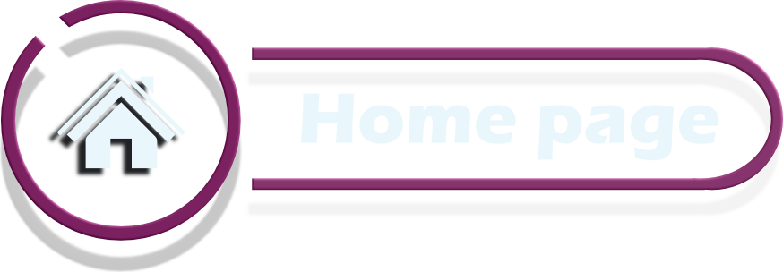

 

# Les enjeux du client

### **1. Encourager le partage de ressources**  
- **Espace dédié** : Les membres peuvent partager des liens, articles ou documents utiles dans un canal spécifique.  
- **Évaluation par la communauté** :  
  - Contributions notées par des réactions comme **"like" 👍** ou **"dislike" 👎**.  
  - Ces évaluations influencent la **réputation** et le **niveau** des utilisateurs.  

### **2. Système de progression basé sur la reconnaissance**  
- Les utilisateurs cumulent des **points** en fonction des **"likes"** reçus sur leurs contributions.  
- En fonction du nombre de points, ils débloquent :  
  - **Rôles spéciaux**.  
  - **Avantages exclusifs** 🏅.  

### **3. Modération semi-automatique du contenu**  
- **Surveillance continue** :  
  - Le bot détecte et supprime automatiquement les contenus inappropriés (ex. : sites pornographiques, contenu NSFW).  
- **Signalements par les utilisateurs** :  
  - Commande dédiée **(!report)** pour alerter les modérateurs.  
  - Les contenus signalés sont supprimés automatiquement si nécessaire.  

### **4. Gestion des doublons**  
- **Comparaison des publications** :  
  - Si une ressource déjà partagée est repostée, le bot conserve la **meilleure version** (celle avec la description la plus complète).  
  - Les points associés à la publication supprimée sont transférés à la publication conservée 🎯.  

