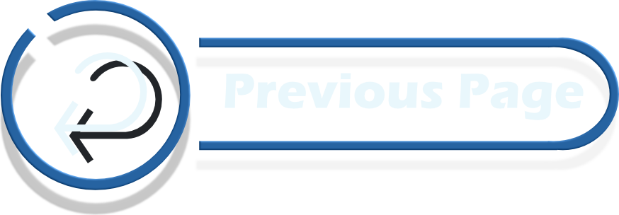

 

# Methodologie Agile

## **Méthodologie : organisation Agile et dailys**

La **méthode Agile** a été utilisée pour structurer le projet, avec un focus sur l’**itération**, la **collaboration**, et l’**adaptabilité**. Chaque sprint a permis d'avancer par étapes courtes et mesurables, tout en favorisant des ajustements réguliers aux besoins.  

### **Organisation en groupes restreints**  
Les membres ont été répartis en petits groupes, chacun responsable d’une partie spécifique du bot Discord (ex. : gestion des utilisateurs, automatisation, modération). Chaque groupe tenait des **daily meetings** pour :  
- Suivre les progrès.  
- Planifier les tâches du jour.  
- Identifier et résoudre les obstacles rapidement.  

### **Coordination globale**  
Des réunions globales régulières avec les 12 membres permettaient de :  
- Synchroniser les efforts entre groupes.  
- Échanger sur les avancées et les défis.  
- Assurer l’intégration des différentes fonctionnalités.  

Cette approche a maximisé la productivité, réduit les blocages et assuré une livraison progressive et cohérente des fonctionnalités.

