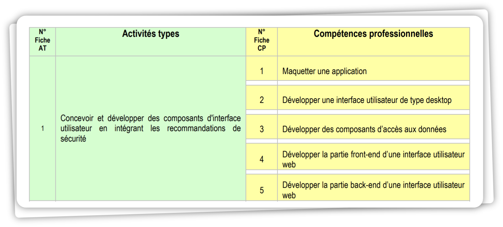

 

# *Structure du Projet fil rouge*

## Sommaire

- [AT 1 : Développement d'interfaces sécurisées](#at-1--développement-dinterfaces-sécurisées)  
    - [Maquetter une application](#maquetter-une-application)  
    - [Développer une interface utilisateur de type desktop](#développer-une-interface-utilisateur-de-type-desktop)  
    - [Développer des composants d'accès aux données](#développer-des-composants-daccès-aux-données)  
    - [Développer la partie front-end d'une interface utilisateur](#développer-la-partie-front-end-dune-interface-utilisateur)  
    - [Développer la partie back-end d'une interface utilisateur web](#développer-la-partie-back-end-dune-interface-utilisateur-web)  

- [AT 2 : Gestion sécurisée des données](#at-2--gestion-sécurisée-des-données)  
    - [Collaborer à la gestion d'un projet informatique et à l'organisation de l'environnement de développement](#collaborer-à-la-gestion-dun-projet-informatique-et-à-lorganisation-de-lenvironnement-de-développement)  
    - [Concevoir une application](#concevoir-une-application)  
    - [Développer des composants métier](#développer-des-composants-métier)  
    - [Construire une application organisée en couches](#construire-une-application-organisée-en-couches)  
    - [Développer une application mobile](#développer-une-application-mobile) 
    - [Préparer et exécuter les plans de tests d'une application](#préparer-et-exécuter-les-plans-de-tests-dune-application) 
    - [Préparer et exécuter le déploiement d'une application](#préparer-et-exécuter-le-déploiement-dune-application) 

- [AT 3 : Développement d'applications multicouches](#at-3--développement-dapplications-multicouches) 
    - [Concevoir une base de données](#concevoir-une-base-de-données)  
    - [Mettre en place une base de données](#mettre-en-place-une-base-de-données)  
    - [Développer des composants dans le langage d'une base de données](#développer-des-composants-dans-le-langage-dune-base-de-données)  

# **AT 1** : *Développement d'interfaces sécurisées*

### Maquetter une application
### Développer une interface utilisateur de type desktop
### Déveloper des composants d'accès aux données 
### Déveloper la partie front-end d'une interface utilisateur 
### Déveloper la partie back-end d'une interface utilisateur web

# **AT 2** : *Gestion sécurisée des données*

 

### Concevoir une base de données 
### Mettre en place une base de données
### Développer des composants dans le langage d'une base de données 

# **AT 3** : *Développement d'applications multicouches*

### Collaborer à la gestion d'un projet informatique et à l'organisation de l'environnement de développement

### Concevoir une application

### Développer des composants métier

### Construire une application organisée en couches

### Développer une application mobile

### Préparer et exécuter les plans de tests d'une application

### Préparer et exécuter le déploiement d'une application

